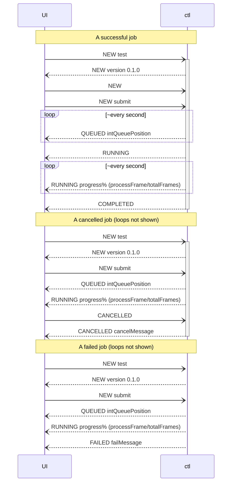

# opentsg-ctl-watchfolder

A simple flat file job controller for opentsg for in minikube.

## State machine

```mermaid
sequenceDiagram
  Note over UI,ctl: A successful job
    UI   -)+  ctl: NEW test
    ctl --)   UI:  NEW version 0.1.0
    UI   -)   ctl: NEW
    UI   -)   ctl: NEW submit
    loop ~every second
        ctl --)   UI:  QUEUED   intQueuePosition
    end
    ctl --)   UI:  RUNNING
    loop  ~every second
        ctl --)   UI:  RUNNING  progress% (processFrame/totalFrames)
    end
    ctl --)-   UI:  COMPLETED

  Note over UI,ctl: A cancelled job (loops not shown)
    UI   -)+  ctl: NEW test
    ctl --)   UI:  NEW version 0.1.0
    UI   -)   ctl: NEW submit
    ctl --)   UI:  QUEUED   intQueuePosition
    ctl --)   UI:  RUNNING  progress% (processFrame/totalFrames)
    UI   -)   ctl: CANCELLED
    ctl --)-   UI: CANCELLED cancelMessage

  Note over UI,ctl: A failed job (loops not shown)
    UI   -)+  ctl: NEW test
    ctl --)   UI:  NEW version 0.1.0
    UI   -)   ctl: NEW submit
    ctl --)   UI:  QUEUED   intQueuePosition
    ctl --)   UI:  RUNNING  progress% (processFrame/totalFrames)
    ctl --)   UI:  FAILED  failMessage

```
